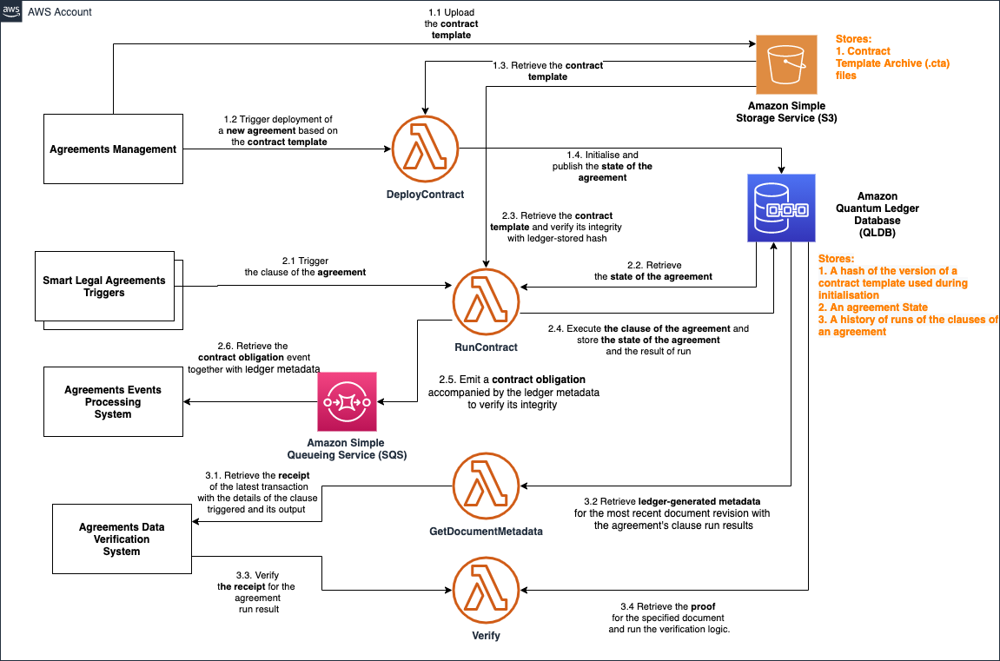

# Smart Legal Agreements on AWS
This sample solution helps to run Smart Legal Agreements developed with a tool set from [Accord Project](https://www.accordproject.org/) on a serverless architecture with AWS Lambda and Amazon Quantum Ledger Database (QLDB) services. With this solution you can:
1. Initialize and deploy Smart Legal Agreements developed with Accord Project tool set to QLDB.
2. Execute deployed Smart Legal Agreements, persist execution results to QLDB and emit contract events to trigger external systems with Ledger Metadata information for verification.
3. Retrieve a specific contract execution result to verify contract event data.
4. Verify Ledger Metadata for a specific contract execution result.

The following diagram illustrates the solution, deployed for a single account.



## Setup

### Pre-requisites
1. Existing AWS account
2. Access Key Id and Secret Access Key
3. Mac or Linux machine to run bash scripts
4. Deployed and configured AWS CLI: https://docs.aws.amazon.com/cli/latest/userguide/install-linux-al2017.html
5. Deployed SAM CLI: https://docs.aws.amazon.com/serverless-application-model/latest/developerguide/serverless-sam-cli-install-linux.html
6. Deployed NodeJS version 10.x (recommended to install with nvm: https://docs.aws.amazon.com/sdk-for-javascript/v2/developer-guide/setting-up-node-on-ec2-instance.html )

### Setup instructions
1. Review and edit the values of the environment variables in `./devops/deploy.sh`
2. Run the build script
   
   ```
   cd ./devops
   ./build.sh
   ```
3. Run the setup script
   
   ```
   cd ./devops
   ./deploy.sh
   ```

### Usage

1. Deploying a new smart legal agreement
   - Download the "Mini-Late Delivery and Penalty Payment" contract template archive from Accord Project Template Library: [minilatedeliveryandpenalty-payment@0.5.0.cta](https://templates.accordproject.org/archives/minilatedeliveryandpenalty-payment@0.5.0.cta)
   - Upload the contract template archive (.cta) file to the root of an S3 bucket that was specified in a `ACCORD_S3_CONTRACTS_REPO_NAME` parameter of `./devops/deploy.sh` file (default name will be `accord-contracts-${AWSRegion}-${AWSAccountId}`).
   - Open your AWS Lambda console: https://console.aws.amazon.com/lambda/home
   - Search for a function with name `accord-contracts-accord-deploy`
   - [Invoke a new test event](https://docs.aws.amazon.com/lambda/latest/dg/getting-started-create-function.html#get-started-invoke-manually) with contract initialization data. For example:
  
  ``` JSON
   {
      "contractSourceS3BucketObjectPath": "minilatedeliveryandpenalty-payment@0.5.0.cta",
      "ledgerDataPath": "Accord",
      "eventsQueue": "accord-contracts-output",
      "contractId": "minilatedeliveryandpenalty-payment",
      "contractData": "{\"$class\":\"org.accordproject.minilatedeliveryandpenalty.MiniLateDeliveryContract\",\"contractId\":\"df12432a-0a82-47d0-9dcb-f3f4527cba32\",\"buyer\":{\"$class\":\"org.accordproject.cicero.contract.AccordParty\",\"partyId\":\"Best Latte\"},\"seller\":{\"$class\":\"org.accordproject.cicero.contract.AccordParty\",\"partyId\":\"Dairy Co.\"},\"penaltyDuration\":{\"$class\":\"org.accordproject.time.Duration\",\"amount\":2,\"unit\":\"days\"},\"penaltyPercentage\":10.5,\"capPercentage\":52,\"maximumDelay\":{\"$class\":\"org.accordproject.time.Duration\",\"amount\":15,\"unit\":\"days\"}}"
   }
  ```
2. Executing a late delivery clause of the agreement
   - Open your AWS Lambda console: https://console.aws.amazon.com/lambda/home
   - Search for a function with name `accord-contracts-accord-execute`
   - [Invoke a new test event](https://docs.aws.amazon.com/lambda/latest/dg/getting-started-create-function.html#get-started-invoke-manually) with delivery invocation data. For example:
  
  
``` JSON
   {
      "ledgerDataPath": "Accord",
      "contractId": "minilatedeliveryandpenalty-payment",
      "requestString": "{\"$class\":\"org.accordproject.minilatedeliveryandpenalty.LateRequest\",\"agreedDelivery\":\"2021-03-01T12:00:00-05:00\",\"deliveredAt\":\"2021-03-10T03:24:00-05:00\",\"goodsValue\":200}"
   }
```

   - [Check the Amazon SQS queue](https://docs.aws.amazon.com/AWSSimpleQueueService/latest/SQSDeveloperGuide/sqs-using-receive-delete-message.html) with the name specified in a `ACCORD_EVENTS_SQS_QUEUE_NAME` parameter of `./devops/deploy.sh` file. It should contain a `PaymentObligation` event with accompanying Ledger Metadata of a QLDB document with contract execution results. It also includes the metadata of the version of document holding contract execution results to use for verification.
  
1. Retrieving the metadata of the latest agreement logic execution result (the receipt)
    - Open your AWS Lambda console: https://console.aws.amazon.com/lambda/home
    - Search for a function with name `accord-contracts-qldb-get-document-metadata`
    - [Invoke a new test event](https://docs.aws.amazon.com/lambda/latest/dg/getting-started-create-function.html#get-started-invoke-manually) with results document id. For example:


  
``` JSON
   {
      "ledgerName": "accord-contracts",
      "tableName": "Accord",
      "documentKey": "minilatedeliveryandpenalty-payment.result"
   }
```


   - **IMPORTANT** To prepare the receipt for verification, you need to:
      - Copy the output from the `accord-contracts-qldb-get-document-metadata` function
      - In the beginning of the stringified object, change the root property name from `"result"`  to `"ledgerMetadata"`
      - Find and replace all `\"` to `"`.
      - Please note there will be stringified Amazon Ion documents with the JSON object. This is expected, don't change them.
      - Use the resulted JSON object in the next step.

2. Verifying Ledger Metadata
    - Open Lambda console: https://console.aws.amazon.com/lambda/home
    - Search for a function with name `accord-contracts-qldb-verify`
    - [Invoke a new test event](https://docs.aws.amazon.com/lambda/latest/dg/getting-started-create-function.html#get-started-invoke-manually) with the "receipt". For example:
  
  ``` JSON
   {
   "ledgerMetadata": {
         "LedgerName": "accord-contracts",
         "TableName": "Accord",
         "BlockAddress": {
            "IonText": "{strandId: \"EFcC1DirgHS6UYGQH83f9L\", sequenceNo: 175}"
         },
         "DocumentId": "L288F48cAgG4mRZTMcgdpt",
         "RevisionHash": "OJo1hlmyVvRHP60jGkIeG44+TDEI0Wtnf+udRfwKFHg=",
         "Proof": {
            "IonText": "[{{kAQiHJo6G3r+l7O8nsHxz1x+NxvVV7JbU961OMVMFyM=}},{{poTwYxv3hKFziofD2u+SfvkPRUMXXcYOd4yj82wBhx4=}},{{m43BXjwJ8Kn9NyAGgai2A9S0/YCfAQfUBt6868mTqOY=}},{{m43BXjwJ8Kn9NyAGgai2A9S0/YCfAQfUBt6868mTqOY=}},{{d2vl/alHEi/4DDiQpSpCXWu9mFDUZyEqvlfGLDAG0dw=}},{{b6YqEUv7MMI3cF3cMF7lgBtikrPAhuF2kwVSUkW8Yh8=}},{{0L7AuMPEGEnmSPEsf5gHj5ryZ47vZZcDh9R9bm7RgvE=}},{{su0Jo/1rIhdHncfm7JRlz3Pv726oPZE4s8R8mvRLC5M=}},{{OBH12ldxb2NkK4M9Jw5JR4JFW5KeRhms9JDAfr4+WMM=}},{{LZgU0jltxUhzCisrM0kxg8FDjIpwCLrVHl0MYDUs9rE=}}]"
         },
         "LedgerDigest": {
            "Digest": "jx1DMTXVkqdFaLdBHlpqG/13SLPlEKFcPlUrH/pWngE=",
            "DigestTipAddress": {
            "IonText": "{strandId:\"EFcC1DirgHS6UYGQH83f9L\",sequenceNo:176}"
            }
         }
      }
   }
  ```

### Other useful features

1. Retrieve full history of agreement logic execution results
    - Open your AWS Lambda console: https://console.aws.amazon.com/lambda/home
    - Search for a function with name `accord-contracts-qldb-get-document-history`
    - [Invoke a new test event](https://docs.aws.amazon.com/lambda/latest/dg/getting-started-create-function.html#get-started-invoke-manually) with results document id. For example:
  
  ``` JSON
   {
      "ledgerName": "accord-contracts",
      "tableName": "Accord",
      "documentKey": "minilatedeliveryandpenalty-payment.result"
   }
   ```

2. Retrieve a specific version of agreement logic execution results document
    - Open Lambda console: https://console.aws.amazon.com/lambda/home
    - Search for a function with name `accord-contracts-qldb-get-document-revision`
    - [Invoke a new test event](https://docs.aws.amazon.com/lambda/latest/dg/getting-started-create-function.html#get-started-invoke-manually) with the details of a specific document revision. For example:
  
  ``` JSON
   {
      "tableName": "Accord",
      "blockAddress": {
         "IonText": "{strandId: \"EFcC1DirgHS6UYGQH83f9L\", sequenceNo: 175}"
      },
      "documentId": "L288F48cAgG4mRZTMcgdpt"
   }
  ```